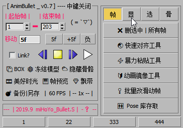
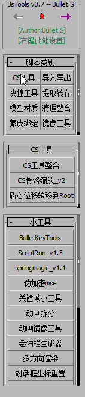
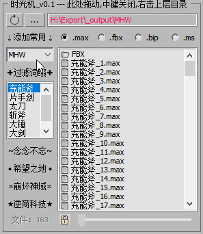

<!--
 * @Description: 
 * @Author: Bullet.S
 * @Date: 2019-12-04 12:47:31
 * @LastEditors: Bullet.S
 * @LastEditTime: 2019-12-15 19:04:46
 * @Email: animator.bullet@foxmail.com
 -->

# aceDocs v0.1_2019.12

> **弄了个记录杂七杂八作品和自学笔记的网站，当然主要是帮助文档...(●—●)**

## 预览

<!-- tabs:start -->

#### ** BulletKeyTools **

  
想把max中K动画可能会用到的功能集成，并尽量精简，  
能直接点的就不浪费脚本按，脚本能左键就不用右键。

#### ** BulletsTools **

  
专为动画师定制，按钮全部可自定义，  
根据文件夹结构生成只属于你自己的工具集合~

##### ** BsOpenTools **

  
BulletKeyTools内置，快速打开文件，  
添加收藏文件夹，方便下次直接打开，  
还能过滤比如Standby，Walk，Run等等自定。

<!-- tabs:end -->
## 下载

&emsp;

## 联系

