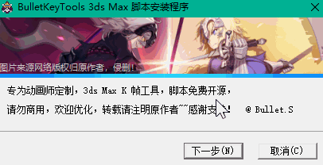

<!--
 * @Description: 
 * @Author: Bullet.S
 * @Date: 2019-12-09 10:04:51
 * @LastEditors  : Bullet.S
 * @LastEditTime : 2019-12-19 22:52:17
 * @Email: animator.bullet@foxmail.com
 -->

# 1.安装脚本

  

!> 注意选择对应版本的 3ds Max 目录，一般来说改个盘符就行了