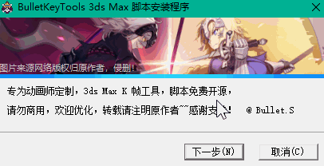
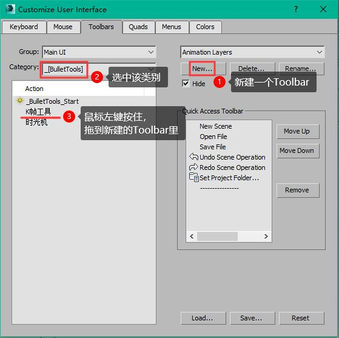
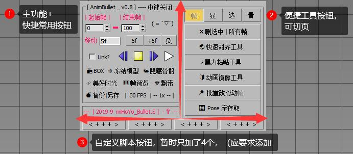
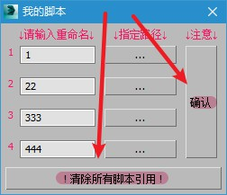
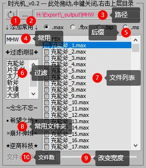

<!--
 * @Description: 
 * @Author: Bullet.S
 * @Date: 2019-12-09 10:04:51
 * @LastEditors  : Bullet.S
 * @LastEditTime : 2019-12-21 22:23:08
 * @Email: animator.bullet@foxmail.com
 -->

## 1. 安装脚本

  

!> 注意选择对应版本的 3ds Max 目录，一般来说改个盘符就行了  

### 1.1 添加工具栏

- 进入 3ds Max 点击菜单栏 “Customize” -- “Customize User Interface...” -- “Toolbars”  

!> 注意第一次安装可能需要重启 Max，或拖入压缩包内的 .ms 脚本到 max（打开插件后脚本可删）  

## 2. 脚本界面

!> v0.8.4 版本时UI，后面可能会修改，有建议欢迎交流~

## 3. 简要说明 （建议 Ctrl + F 搜索关键词）

### 3.1 MainUI：

- <mark>开关:</mark>  
中键点击--界面空白处或者“中键关闭”上可关闭脚本  
- <mark>起始帧，结束帧</mark>  
改变帧栏范围（emmm）  
- <mark>(*｀▽´*)颜文字</mark>  
界面切换开关，简易和多功能模式  
- <mark>移动帧数</mark>  
输入或者默认5帧，累加5帧，切换负帧，对应下面的移动帧功能  
- <mark>link？勾选框</mark>  
移动帧中是否包含Link帧（没有时可加快效率）  
- <mark>移动按钮</mark>  
选择滑条前面关键帧，选择所有关键帧，选择滑条后关键帧，（均包含帧栏外），  
白色按钮为移动帧，左右键分别可选是否自动给帧范围扩充移动帧数  
`有选择物体则处理选择，否则处理全部物体的帧,`  
- <mark>Box</mark>  
切换Box线框显示
- <mark>冻结模型</mark>  
冻结 Mesh 或者 Poly 模型，取消check即解冻  
- <mark>隐藏骨骼</mark>  
左键--隐藏 Bone，右键--隐藏 Biped，再点可显示，  
`只处理当前显示的骨骼~`  
- <mark> [美好时光](/tools/BulletKeyTools?id=_41-美好时光（时光机）) </mark>  
简易文件管理工具，打开文件收藏目录等，后面做详细说明。[传送门](/tools/BulletKeyTools?id=_41-美好时光（时光机）)  
- <mark>帧预览</mark>  
左键--显示选择关键帧范围，右键--显示首尾关键帧范围，选中或所有，  
再点回到之前帧范围，适合快速预览动画，不灵的话多点几次(手动滑稽)  
- <mark>飘带</mark>  
左键--新版Crazyone大佬优化版（请尊重原作者留ID），右键--v0.9原版  
- <mark>备份 | 另存</mark>  
左键--快速备份，在同目录下生成"_Backup*"后缀的max文件，右键--快速另存文件  
- <mark>帧率 播放速率</mark>  
显示当前帧率和播放速率，左击--修改帧率，右击--修改速率，  
新开文件后需要手动点下才会刷新（因为装了Max杀毒卫士会自动禁用自定义回调）  
- <mark>"---  | 2019.9  miHoYo_Bullet.S |  - ？ --"</mark>  
点击直达帮助文档网站~  

---

### 3.2 小工具：

<!-- tabs:start -->

#### **帧**

- <mark>删选中 | 所有帧</mark>  
删除关键帧，Link帧暂时请手动删~  
- <mark>快速对齐工具</mark>  
待添加，想重新写或者优化一个现有的。  
- <mark>暴力粘贴工具</mark>  
暂时引用的经典的吇鱼大佬那版，可能之后厉害点会考虑优化或重构。  
- <mark>动画镜像工具</mark>  
暂时引用的4698to大佬那版，可能之后厉害点会考虑优化或重构。  
- <mark>批量改滑动帧</mark>  
以前写的一个简单脚本，需求大的话后面可做优化。  
- <mark>Pose 库存取</mark>  
目前没找到很好用的，近期考虑优先写一个或优化一个~  

#### **显**

- <mark>显示 | 清除 Bone轨迹</mark>  
左键：切换显示选择 Bone 的轨迹，右键：清除所有Bone的轨迹显示
- <mark>单加 | 清除 Biped 轨迹</mark>  
左键：给选择Biped添加单独轨迹，右键：清除所有Biped轨迹
`（原理是加了个看不见的虚拟体，注意会建一个新层存放，可右键一键清除）`
- <mark>隐藏当前未选中物体</mark>  
快速切换显示选中物体或之前场景物体，比 alt+Q 唯一方便在于不会拉近镜头，  
后面会考虑把一些常用方便的功能加到快捷键或者右键菜单。  
- <mark>快速拍屏 | 打开目录</mark>  
快速拍屏当前场景，非渲染，不显示骨骼，右键打开保存默认目录  
- <mark>整数小数帧切换</mark>  
小技巧：小数帧显示时拖动滑条能看到更多原本看不到的问题如卡顿欧拉角等。  
- <mark>白模 | 红模材质切换</mark>  
字面意思~切换预览窗的材质显示，暂不支持Vray和多维子材质。  

#### **选**

- <mark>以同颜色选择</mark>  
功能就是字面意思~注意虚拟体看似颜色相同，代码上并不是...  
- <mark>Biped | Bone选择</mark>  
功能效果类似于按H，输入Bip或者Bone，再回车~  
但谁能保证Bone骨骼命名一定以Bone开头呢？（项目通常不会）  
- <mark>动画片断记录</mark>  
功能待添加，可提供宝贵建议~  
主要用于长动画记录每个分段的动作，方便一键查看。  
由于根据文件来保存的机制尚未想好，所以待更新~  
- <mark>表情滑条</mark>  
修改自海外大佬的一个小脚本。
一个简单的根据带Morpher表情的模型生成快速调试的滑条。  
防止没有控制器的表情模型需要解冻模型选择mesh再调表情。  
（最好还是给你喜欢的模型加一套方便美观的表情控制器吧~）  
- <mark>CS 选择工具</mark>  
引用 CGJOY 论坛看到的一个脚本，个人觉得功能太多太臃肿，  
所以精简了下，并未做其他任何改动，请尊重原作者~  
- <mark>系统易用设置</mark>  
功能待添加，可提供宝贵建议~  
想法是把K帧快捷键和比如自动备份的设置整合在一个界面，方便修改。但可能只会用几次，实用性不大，后续考虑怎么优化~  

#### **骨**

- <mark>Euler | TCB 互转</mark>  
简单来说就是欧拉和TCB互转，针对Bone。
- <mark>欧拉曲线过滤</mark>  
字面功能~解决一些Bone在解算后可能出现的跳动翻转。
- <mark>清除 | 添加末端</mark>  
功能待添加，可提供宝贵建议~  
看动画师工具上有，但是个人感觉实用性可能不算太大，可能考虑后面换个功能。  
- <mark>清范围外关键帧</mark>  
清理无限帧，飘带解算后小概率出现，注意不要把需要的关键帧清掉了！  
- <mark>批量导入导出</mark>  
功能待添加，可提供宝贵建议~  
后面考虑加入到颜文字右键切出面板中，大坑待填优先级较高~  

<!-- tabs:end -->  

### 3.3 自定义脚本按钮：  

  

!> 把脚本放到按钮上引用来点击运行，如果没有脚本引用，左键点击会让你选择添加哪个,  
右键点击如上图，可以重命名显示的名字（不改变文件名），也可一键清除4个按钮的设定，  
暂时只有4个，如果需要更多可以使用我另一个脚本：[BulletTools](tools/BulletTools.md)  

## 4.具体介绍

### 4.1 美好时光（时光机）  

  

!>
①&emsp; “刷新”按钮&emsp;&emsp;：左键-刷新，建议多按；右键-可快速重置场景  
②&emsp; “...”按钮 &emsp;&emsp;&emsp;：左键-选择显示的目录；右键-快速打开右边目录  
③&emsp; “目录”框&emsp;&emsp;&emsp;：显示当前打开文件目录或者常用文件夹目录。  
④&emsp; “常用目录”&emsp;&emsp;：点击添加，右键选中的目录删除单个。  
⑤&emsp; “文件后缀”&emsp;&emsp;：max文件直接打开，fbx导入，bip静默导入，ms运行脚本  
⑥&emsp; “过滤词缀”&emsp;&emsp;：只显示含有选择字符名字的文件。  
⑦&emsp; “文件列表”&emsp;&emsp;：右键可返回上级目录，没有时右键点击界面空白处  
⑧&emsp; “常用文件夹”&emsp;：自行探索，包括最近打开文件等常用目录  
⑨&emsp; “改变宽度”&emsp;&emsp;：可记录调节宽度方便显示更长的文件名。  
⑩&emsp; “文件数”&emsp;&emsp;&emsp;：统计列表显示文件数量。  